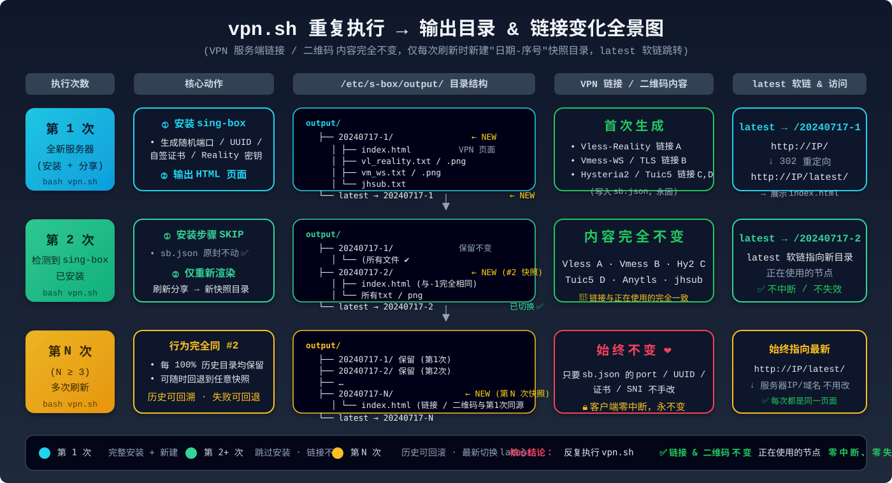

# VPN 一键部署脚本（Sing-box + Nginx + HTML 配置页）

> 🛒 **购买稳定的 VPS 主机** → <https://lisahost.com/>
>
> 推荐使用 **Debian 11 / 12** 或 **Ubuntu 22.04 LTS** 系统，内存 ≥ 512MB，硬盘 ≥ 5GB 的任意 VPS。

***

## 🔥 简介

本项目把 [sb.sh ](https://github.com/yonggekkk/sing-box-yg) 脚本做了封装 + 增强，**只需要一条命令** 就可以在 VPS 上完成：

1. ✅ 安装 wget / curl / jq / nginx 等基础依赖
2. ✅ 部署 sing-box（自动生成随机端口、UUID、自签证书、Reality 密钥）
3. ✅ 自动生成 **Vless-Reality / Vmess-WS / Vmess-WS-TLS / Hysteria-2 / Tuic-v5 / Anytls** 六种协议节点
4. ✅ 把所有协议的**分享链接 + 二维码 + 协议详情** 渲染成一个漂亮的 HTML 页面
5. ✅ 安装 & 配置 Nginx，**直接输入服务器 IP 就能在浏览器看到 VPN 配置页**
6. ✅ 重复执行也**不会改变已有的 VPN 链接**，正在使用的节点零中断、零失效

***

## 📦 本目录文件清单

| 文件                                               | 说明                                                             | 执行方式                                                  |
| ------------------------------------------------ | -------------------------------------------------------------- | ----------------------------------------------------- |
| [vpn.sh](./vpn.sh)                               | **⭐ 主脚本（一键部署）**                                                | `bash vpn.sh` 在 VPS 上执行                               |
| [sb.sh](./sb.sh)                                 | 原版 sing-box 多协议部署脚本（由 vpn.sh 自动打补丁后调用）                         | 不需要手动执行                                               |
| [sb\_output.sh](./sb_output.sh)                  | 辅助脚本：生成日期目录、二维码、HTML 页面（vpn.sh 会复制到 `/etc/s-box/sb_output.sh`） | 通常不手动执行，需要单独刷新可运行 `bash /etc/s-box/sb_output.sh main` |
| [sb\_modified.sh](./sb_modified.sh)              | sb.sh 的早期合并改造版本（保留作备份，当前已不使用）                                  | -                                                     |
| [test\_output\_local.sh](./test_output_local.sh) | 本地测试脚本（WSL / Git Bash 下直接跑 HTML 生成效果，无需真 VPS）                  | `bash test_output_local.sh`                           |
| [重复执行记录.png](./重复执行记录.png)                       | 用户提供的重复执行记录参考图                                                 | -                                                     |
| [重复执行演变图.svg](./重复执行演变图.svg)                     | 重复执行 vpn.sh 输出目录 & 链接变化全景示意图（SVG 矢量版）                          | 浏览器直接打开                                               |
| mock/ 目录                                         | 本地测试用的 sb.json 和各协议分享链接 mock 数据（test\_output\_local.sh 运行时会复制） | -                                                     |

***

## 🚀 最快上手（三步完成部署）

### Step 1: 购买主机 & 准备环境

1. 访问 **[lisahost.com](https://lisahost.com/)** 选购一台海外 VPS，推荐 **Debian 12 x86\_64**，最少 1 vCPU / 512MB RAM。
2. 购买完成后会收到邮件里的 **公网 IP** + **root 密码**。
3. 本地打开 PowerShell / FinalShell / Xshell / iTerm，SSH 登录：

```bash
ssh root@<你的公网IP>
# 输入密码后进入服务器终端
```

### Step 2: 上传脚本到服务器（Windows 用户）

在 **本地 PowerShell**（不是服务器 SSH 里）执行：

```powershell
# 把 vpn.sh 上传到服务器 /root 目录
scp "D:\Lisa主机网络建设\vpn.sh" root@<你的公网IP>:/root/

# 可选：也把 sb.sh 一起上传，vpn.sh 也会自动联网下，上传省等待时间
scp "D:\Lisa主机网络建设\sb.sh"  root@<你的公网IP>:/root/
```

### Step 3: 一键部署（在服务器 SSH 里执行）

```bash
cd /root
chmod +x vpn.sh sb.sh 2>/dev/null

# ⭐ 推荐：后台运行（避免 SSH 断连导致中途失败，全程约 10-15 分钟）
nohup bash vpn.sh > vpn_deploy.log 2>&1 &

# 查看实时进度，Ctrl+C 退出不影响后台执行
tail -f vpn_deploy.log
```

等待脚本最后打印：

```
========================================================================
   🌐 访问地址（浏览器直接打开即可查看 VPN 配置页）：
      http://<你的公网IP>/               （自动跳转到最新配置）
      http://<你的公网IP>/latest/        （直接访问最新目录）
========================================================================
```

**复制地址到浏览器，就能看到所有节点二维码和分享链接了 🎉**

---

## 📱 客户端工具指南（扫码 & 导入链接）

本项目生成的六种协议分享链接（Vless-Reality、Vmess-WS、Vmess-WS-TLS、Hysteria2、Tuic-v5、Anytls）和 `jhsub.txt` 的**聚合节点链接**，主流客户端都可以直接**扫二维码**或**复制链接粘贴导入**。下面按平台列出常用工具和使用步骤：

### 📲 按平台选择客户端

| 平台 | 推荐工具（优先级从高到低） | 商店 / 获取方式 | 扫码 | 粘贴链接 | 导入订阅 |
|------|--------------------------|:-------------:|:----:|:------:|:------:|
| **iOS / iPadOS** | ① **Shadowrocket（小火箭）** ⭐首选 <br> ② Stash <br> ③ Quantumult X <br> ④ Surge for iOS <br> ⑤ sing-box 官方 SFI（App Store 搜 **SFI**） | App Store（美区/港区账号下载） | ✅ | ✅ | ✅ |
| **Android** | ① **v2rayNG** ⭐首选（免费，全协议）<br> ② **NekoBox**（CatBox 升级版，UI 更现代）<br> ③ sing-box 官方 **SFA**（App Store / Play 搜 **SFA**）<br> ④ Clash Meta For Android（Clash 格式） | GitHub 开源 / F-Droid / Play 商店 | ✅ | ✅ | ✅ |
| **Windows** | ① **v2rayN** ⭐首选（免费，国内用户最多）<br> ② **NekoRay**（跨平台，Qt 版 NekoBox）<br> ③ **Clash Verge Rev**（Clash 格式，界面漂亮）<br> ④ sing-box 官方 **SFM**（桌面版 sing-box GUI） | GitHub 开源下载 | ✅ | ✅ | ✅ |
| **macOS** | ① **Clash Verge Rev** ⭐（M1/M2/M3 原生）<br> ② **Shadowrocket for macOS**（App Store，和 iOS 同一授权）<br> ③ Surge 5 for Mac<br> ④ **V2rayU**（免费，菜单栏工具）<br> ⑤ sing-box 官方 **SFM** | App Store 或 GitHub | ✅ | ✅ | ✅ |
| **Linux** | ① **Clash Verge Rev**（AppImage，最省心）<br> ② **NekoRay**（Qt 跨平台）<br> ③ sing-box 命令行（高级用户） | GitHub AppImage / pacman -S / apt | ❌ | ✅ | ✅ |
| **路由器 (OpenWrt/梅林/Padavan)** | ① **PassWall2** ⭐（OpenWrt 首选）<br> ② **Hello World / luci-app-vssr**<br> ③ ShadowSocksR Plus+ <br> ④ sing-box 原生（手动配置） | 对应固件软件源 | ❌ | ✅ | ✅ |

---

### 🌟 热门客户端「三步扫码 / 导入」图解

#### 🔥 ① Shadowrocket 小火箭（iPhone / iPad / Mac 最热门）
> App Store 搜索 **Shadowrocket**，美区 / 港区账号可下载，**买断制一次购买三端通用**。

```
步骤 1：打开 小火箭 App → 右上角 ➕ 按钮
步骤 2：类型选择 「扫码」→ 对准 index.html 上的二维码
         （或点「类型」选对应协议 → 手动粘贴链接）
步骤 3：页面自动填入 → 右上角「保存」→ 打开顶部开关即可使用

💡 一次导入所有节点：把 jhsub.txt 的聚合链接复制出来
    → 小火箭点「配置」→ 添加 → 填入 URL → 打开即可
```

支持协议：Vless / Vmess / Trojan / Hysteria2 / Tuic / Shadowtls ✅ 全覆盖。

#### 🔥 ② v2rayNG（Android 免费首选）& **v2rayN（Windows 免费首选）**
> 两个工具出自同一作者，界面和操作逻辑几乎完全一致。

```
v2rayNG（Android）：
    右上角 ➕ → 选「扫描二维码」或「从剪贴板导入」
v2rayN （Windows）：
    顶部菜单「服务器」→「扫描屏幕二维码」或「从剪贴板导入批量 URL」

💡 批量导入：在 index.html 点【复制聚合链接】按钮
    → v2rayN 按 Ctrl+V 一次性导入所有 6 条协议节点
```

#### 🔥 ③ NekoBox（Android）/ NekoRay（Windows / Linux）
> 新一代跨平台 sing-box 内核客户端，**界面现代、协议原生支持**。

```
NekoBox (Android)：
    首页 → 右下角「+」→「Scan QR code」扫码
    或 → 「Import from Clipboard」从剪贴板导入
NekoRay (Windows/Linux)：
    菜单 → 「分组」→「粘贴分享链接」或「添加订阅」
    主界面底部选节点，按 Ctrl+Alt+K 切换系统代理开关
```

#### 🔥 ④ Clash Verge Rev（Windows / macOS / Linux 一站式）
> Clash 内核 + TUN 模式，**游戏/视频/全机代理体验最好**。
> 注意：Clash 对 Hysteria2 / Tuic-v5 原生体验不如 sing-box 内核客户端。

```
推荐用法：jhsub.txt 的聚合链接给 v2rayNG/NekoBox，
        Clash Verge 专门用来导订阅格式的 yaml（机场订阅）。
步骤：Clash Verge → 侧边栏「订阅」→ 新建 → 粘贴 Clash 格式订阅 URL
```

#### 🔥 ⑤ sing-box 官方三件套（SFI / SFA / SFM）
> sing-box 项目团队官方 GUI，纯原生 sing-box 内核，新协议支持永远最快。

| 缩写 | 全名 | 平台 | 下载位置 |
|------|------|------|----------|
| **SFI** | sing-box for iOS | iPhone / iPad | App Store 搜 **SFI** |
| **SFA** | sing-box for Android | Android / Google TV / 车机 | GitHub / Play 搜 **SFA** |
| **SFM** | sing-box for macOS / Windows / Linux | 桌面全平台 | GitHub / Homebrew |

```
SFI / SFA 扫码步骤：首页右上角「+」→「New profile from QR code」
SFM 桌面版：菜单 → Profiles → Import → 粘贴 URL 或拖入 sb.json
```

---

### 📋 协议 × 客户端 兼容性矩阵（✅=原生支持，🟡=需新版，❌=不支持）

| 客户端 | Vless-<br>Reality | Vmess-<br>WS | Vmess-<br>WS-TLS | Hysteria-2 | Tuic-v5 | Anytls /<br>ShadowTLS |
|--------|:---:|:---:|:---:|:---:|:---:|:---:|
| **Shadowrocket（小火箭）** | ✅ | ✅ | ✅ | ✅ | ✅ | ✅ |
| v2rayNG / v2rayN | ✅ | ✅ | ✅ | ✅ | ✅ | ✅ |
| NekoBox / NekoRay | ✅ | ✅ | ✅ | ✅ | ✅ | ✅ |
| sing-box 官方 SFI/SFA/SFM | ✅ | ✅ | ✅ | ✅ | ✅ | ✅ |
| Clash Verge Rev (mihomo) | ✅ | ✅ | ✅ | ✅ | ✅ | 🟡 |
| Stash (iOS/macOS) | ✅ | ✅ | ✅ | ✅ | ✅ | ✅ |
| Quantumult X | ✅ | ✅ | ✅ | ❌ | ❌ | 🟡 |
| Surge 5 | ✅ | ✅ | ✅ | ✅ | ❌ | ✅ |
| OpenWrt PassWall2 | ✅ | ✅ | ✅ | ✅ | ✅ | ✅ |

---

### 💡 小贴士

1. **iOS 用户**：如果小火箭扫码二维码是正方形却识别不出来，建议用 **vpn.sh 生成的 index.html 上的【复制链接】按钮**，把链接发到 iPhone 备忘录 → 长按选「Shadowrocket：拷贝链接」直接导入，更稳。
2. **优先试 Hysteria2 或 Tuic5**：这两个是 UDP 协议，弱网、跨运营商、丢包高时速度往往比 Vmess 快很多。
3. **聚合节点（jhsub.txt）**：任何客户端选「从剪贴板导入批量 URL / 粘贴分享链接」都能一次性导入全部 6 条协议节点，**不要一条一条扫二维码**。
4. **Ghelper 冲突排查**（见下一节）：如果浏览器访问配置页被系统代理拦截，记得把 VPN 服务器 IP 加入 Ghelper 的直连列表，或临时切到「仅国内站点加速」模式。

---

## 🌐 其他 VPN / 科学上网服务推荐

除了自己搭建 sing-box 节点，也可以直接购买现成的 VPN 服务或使用浏览器插件，省去维护成本。下面整理了三种可选方案：

### 1️⃣ NFSQ · 机场订阅

| 项目 | 说明 |
|------|------|
| 🔗 官方地址 | [https://www.nfsq.us/#/dashboard](https://www.nfsq.us/#/dashboard) |
| 类型 | 订阅制 "机场"（多节点共享）|
| 适用场景 | 不想自己买 VPS / 不想维护，追求「开箱即用」和多地区切换 |
| 客户端兼容 | Clash / V2rayN / v2rayNG / Shadowrocket / NekoBox / sing-box 等全部主流客户端 |
| 与本项目关系 | 购买后得到的 Clash / sing-box 订阅链接，可以直接存到 `/etc/s-box/output/` 目录下由 Nginx 对外分发；或把单个节点 URL 放到自己的 index.html 里作为补充线路 |

### 2️⃣ 长城 · 老牌科学上网服务

| 项目 | 说明 |
|------|------|
| 🔗 官方地址 | [https://xn--gmqz83awjh.org/auth/login](https://xn--gmqz83awjh.org/auth/login) |
| 类型 | 老牌 VPN / 科学上网服务平台 |
| 适用场景 | 对节点稳定性、速度、全球覆盖（港台美日新欧洲多条线路）有较高要求的用户 |
| 使用方式 | 登录后下载对应客户端配置（Windows / macOS / iOS / Android）|
| 与本项目关系 | 可单独使用；也可以把它提供的 sing-box / Clash 订阅链接与自建 vpn.sh 的 6 条自建协议节点**合并放在同一个客户端**，实现「自建+订阅」双保险切换 |

### 3️⃣ Ghelper · Chrome / Edge 浏览器插件

| 项目 | 说明 |
|------|------|
| 🔗 安装方式 | Chrome 网上应用店 / Edge 外接程序商店 搜索 **「Ghelper」** 安装；或官网 [github.com/ghelper/ghelper](https://github.com/ghelper/ghelper) 提供手动 crx 安装说明 |
| 类型 | 浏览器级别的轻量代理插件（不影响系统全局网络）|
| 适用场景 | 日常查资料、Google 搜索、YouTube、学术论文访问，不想在办公电脑上装全局 VPN |
| 特点 | <ul><li>✅ 零配置，登录即启用</li><li>✅ **仅代理浏览器流量**，不影响微信/钉钉/公司内网/局域网打印机</li><li>✅ 支持自定义域名分流（国内站点直连、海外走代理）</li><li>✅ 适合临时场景、公共电脑、办公环境、家长电脑</li></ul> |
| 与本项目关系 | <ul><li>⚠️ **如果浏览器访问 `http://<服务器IP>/latest/` 打开 vpn.sh 发布的配置页时出现 502 / 被代理拦截**：请在 Ghelper 里把你的 VPN 服务器公网 IP **加入"直连域名"列表**（或临时切换到「仅国内加速」模式），避免被 Ghelper 的全局代理模式误转发。</li><li>✅ 平时浏览正常使用 Ghelper，需要用全局节点时再切到 Shadowrocket / v2rayNG，两者搭配体验最佳。</li></ul> |

---

### 📊 自建 vs 三种现成服务 对比速查表

| 特性 | 自建 (vpn.sh + VPS) | NFSQ 订阅 | 长城 VPN | Ghelper 插件 |
|------|:------------------:|:---------:|:--------:|:------------:|
| 成本 | VPS 月付 \$3-8 | 订阅月付 | 订阅月付 | 基础功能免费 / 高级会员付费 |
| 稳定性 | 靠自己维护 | ✅ 团队运维 | ✅ 团队运维 | ⭐ 简单但仅限浏览器 |
| 节点数量 | 1~2 台（自己定）| ✨ 几十上百条 | ✨ 几十上百条 | 若干条 |
| 速度 | 独享带宽（看 VPS）| 多人共享带宽 | 多人共享带宽 | 与插件路线相关 |
| 可控性 | 🔑 100% 根权限 + 私钥 | 账号权限 | 账号权限 | 浏览器级 |
| 分享给家人/朋友 | ✅ 一人搭建多人用 | 需共用账号 | 需共用账号 | ❌ 仅限本浏览器 |
| 全设备可用 | ✅ 手机/PC/路由 | ✅ | ✅ | ❌ 仅限 Chromium 内核浏览器 |
| 适合人群 | 技术党 / 数据主权党 / 小团队 | 普通个人用户 | 商务/跨国访问需求 | 轻度使用 / 办公场景 |

---

### 💡 组合使用建议（四层叠加最稳）

> **「Ghelper 浏览器轻量 → NFSQ/长城 日常稳定 → vpn.sh 自建固定 IP → 路由器全家桶」四层叠加最省心**
>
> - **工作电脑**（办公内网 + 不敢装客户端）→ 用 **Ghelper**
> - **日常手机 / 平板 / 刷视频** → 连 **NFSQ / 长城** 的多地区节点，高峰期自动切换
> - **自己出差 / 小团队共享 / 需要固定出口 IP**（公司白名单、远程 SSH、跑脚本）→ 用 **vpn.sh 自建**，链接挂到自己 Nginx 上，想加线路随时加，数据全在自己手里
> - **家里电视 / Switch / PS5 / 全家人共用** → 在 OpenWrt 路由器上装 **PassWall2**，导入上面三种服务的订阅作为负载均衡池，全屋自动分流

***

## 📁 服务器端输出目录结构

脚本安装完成后，所有文件都在下面两个目录里：

```
/etc/s-box/
├── sb.json                   ✅ VPN 核心配置（端口/UUID/证书/SNI，永固）
├── cert.pem / private.key     📜 自签 TLS 证书
├── sb_output.sh              🔧 HTML 生成辅助脚本
├── vl_reality.txt            🔗 各协议分享链接临时文件
├── vm_ws.txt / vm_ws_tls.txt / hy2.txt / tuic5.txt / an.txt / jhsub.txt
├── geoip.db / geosite.db     🌍 IP / 域名路由库
└── output/                   🌐 Nginx 网站根目录
    ├── 20240717-1/           ← 第一次刷新的快照
    │   ├── index.html         📄 最终页面：二维码 + 链接 + 复制按钮 + 协议详情
    │   ├── vl_reality.png     🖼 二维码 PNG（有 qrencode 才会生成）
    │   ├── vl_reality.txt     🔗 该协议的分享链接
    │   ├── vm_ws.png / vm_ws.txt
    │   ├── hy2.png  / hy2.txt
    │   ├── tuic5.png / tuic5.txt
    │   └── jhsub.txt          📡 所有协议的聚合链接
    ├── 20240717-2/           ← 第二次刷新的快照（内容和 -1 完全相同）
    └── latest  →  20240717-N ← 软链，永远指向最新的日期目录
```

Nginx 配置的访问链路：

```
http://<服务器IP>/
    │
    └── Nginx location = /  → 302 重定向到 /latest/
              │
              └── Nginx location ^~ /latest/
                     │
                     └── alias /etc/s-box/output/latest/
                              │
                              └── index.html  → 返回浏览器 🎉
```

> 💡 **/etc/s-box/output/ 支持 autoindex 列目录**：直接访问 `http://<服务器IP>/` 根路径会 302 到 latest；访问 `http://<服务器IP>/output/`（如果 nginx root 已设对）也能浏览历史快照目录。

***

## 🔁 重复执行 vpn.sh 会发生什么？（附演变图）

**核心结论：✅ VPN 链接 / 二维码 内容完全不变，正在使用的节点零中断、零失效。**

| 场景                    |        安装步骤（sing-box）        |             分享链接 / 二维码            |                   输出目录                   |    正在使用的节点   |
| --------------------- | :--------------------------: | :-------------------------------: | :--------------------------------------: | :----------: |
| 第 1 次执行（全新机器）         |      ✅ 正常执行 → 写入 sb.json     |                首次生成               |      新建 `YYYYMMDD-1` + latest → `-1`     |       -      |
| 第 2 次执行               | ❌ 检测到 sing-box 服务 → **跳过安装** | **从 sb.json 重新读取**，内容与第一次 100% 相同 | 新建 `YYYYMMDD-2`（旧目录完整保留） + latest → `-2` |   ✅ **零中断**  |
| 第 N 次执行               |             ❌ 跳过             |             内容与第一次完全一致            |       新建 `YYYYMMDD-N`，latest → `-N`      |   ✅ **零中断**  |
| 手动改配置（菜单 2 修改端口/UUID） |        ⚠️ 重新写入 sb.json       |         ⚠️ **链接 / 二维码变化**         |              新目录 + latest 切换             | ⚠️ **旧链接失效** |

***

### 🎨 重复执行演变全景图（SVG 矢量）

**[点击在新窗口打开高清 SVG](./重复执行演变图.svg)**



<br />

***

## ❓ FAQ

### Q1: 运行时出现 `Permission denied`？

```
chmod +x vpn.sh
bash vpn.sh    # 推荐用 bash 前缀，无需管 x 权限
```

### Q2: 提示 `bad interpreter: /bin/bash^M` 是什么？

Windows 上传的文件换行符是 CRLF，Linux 不认。服务器上执行：

```bash
apt-get install -y dos2unix 2>/dev/null || yum install -y dos2unix 2>/dev/null
dos2unix vpn.sh sb.sh
```

### Q3: 浏览器访问 `http://<IP>/` 返回 502 `DNS lookup for ... failed`？

这**不是** vpn.sh / Nginx 的问题，是你的请求经过了**中间层代理 / CDN / WAF**。

- 验证方法：用手机 4G 直接访问这个 IP，或者本地开无痕窗口 + `--noproxy '*'` curl：
  ```powershell
  curl -sv --noproxy '*' http://<你的IP>/
  ```
- 如果本机直接请求正常 → 就是本地浏览器代理/公司网络代理的问题，关掉代理即可。

### Q4: 为什么 HTML 页面里没有二维码 PNG？

服务器没装 qrencode 时就不会生成图片，但**分享链接的文字内容不受影响**。手动装一下：

```bash
apt-get install -y qrencode 2>/dev/null || yum install -y qrencode 2>/dev/null
bash /etc/s-box/sb_output.sh main   # 重新生成一遍，就有二维码了
```

然后刷新浏览器就能看到二维码图片。

### Q5: 想重新生成链接 / 回到最新页面，不用整脚本重跑

```bash
# 只调用 sb.sh 的分享功能（菜单 9 → 1 → 0 → 0）
cd /root
(echo "9"; sleep 3; echo "1"; sleep 10; echo "0"; echo "0") | bash sb.sh
# 或直接调用底层脚本
bash /etc/s-box/sb_output.sh main
```

会自动生成一个新的日期目录，`latest` 软链自动切换过去。

### Q6: Nginx 默认端口 80 被占用了，想改 8080

编辑 Nginx 配置：

```bash
# Debian / Ubuntu
vi /etc/nginx/sites-available/default
# CentOS
vi /etc/nginx/conf.d/default.conf
```

把 `listen 80 default_server;` 改成 `listen 8080 default_server;`，重启：

```bash
nginx -t && systemctl restart nginx
```

访问地址变成 `http://<IP>:8080/`。别忘了开云厂商的安全组端口。

### Q7: 如何启用 HTTPS（80→443）？

如果有域名（A 记录解析到 IP），用 certbot 一键：

```bash
apt install -y certbot python3-certbot-nginx 2>/dev/null \
    || yum install -y certbot python3-certbot-nginx 2>/dev/null
certbot --nginx -d vpn.example.com
```

certbot 会自动写入 443 server，并把 80 永久 301 跳转到 HTTPS。

### Q8: 服务器重装后 Nginx 配置还在吗？

重装系统后不在了。但只要 `/etc/s-box/sb.json` 备份了一份，在新机器上：

1. 重新把 vpn.sh 传上去
2. 手动把 `sb.json` 放回 `/etc/s-box/sb.json`（覆盖新安装的）
3. `bash vpn.sh` 跑完后，再单独执行 `bash /etc/s-box/sb_output.sh main`
4. 重新用 Nginx 发布出来

新链接和旧链接**完全一样**（UUID/端口/证书同源），客户端完全不用改配置。

***

## 🧪 本地预览 HTML 页面（无需真 VPS）

想先看 HTML 渲染效果、不花 VPS 钱？直接在 Windows 上跑：

```bash
# 打开 WSL / Git Bash
cd /d/Lisa主机网络建设
bash test_output_local.sh
```

脚本会自动：

- 复制 mock/ 里的假数据 → 当前目录的 `test_output/`
- 本地化 sb\_output.sh 的路径
- 生成带真实协议字段、分享链接占位符的 index.html
- 自动用系统默认浏览器打开页面

想手动打开：`test_output/output/latest/index.html`。

***

## 🔐 安全提示

1. **`sb.json`** **和** **`private.key`** **包含 VPN 的核心密钥**，不要公开、不要提交到公共仓库。
2. Nginx 默认开了 autoindex，虽然只读，但如果不想让外人浏览所有历史快照，把 nginx 配置里的 `autoindex on;` 改成 `autoindex off;`。
3. 建议在云厂商安全组里只开放 **TCP 80** 和 VPN 协议实际监听的端口段（可看 `/etc/s-box/sb.json` 的 listen\_port），其他端口全部关。
4. 如果担心 SSH 密码登录，建议在完成部署后改成 SSH Key 登录 + 禁 PasswordAuth。

***

## 📞 相关链接

- 🛒 **主机购买地址：** <https://lisahost.com/>
- 📦 **sb.sh 原版仓库：** [github.com/yonggekkk/sing-box-yg](https://github.com/yonggekkk/sing-box-yg)
- 🎧 **Sing-box 官方文档：** [sing-box.sagernet.org](https://sing-box.sagernet.org/)
- 🌐 **Nginx 官方文档：** [nginx.org/en/docs](https://nginx.org/en/docs/)

